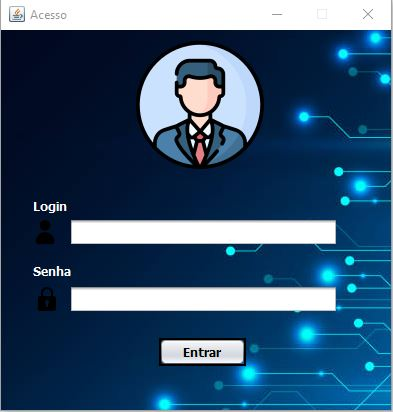
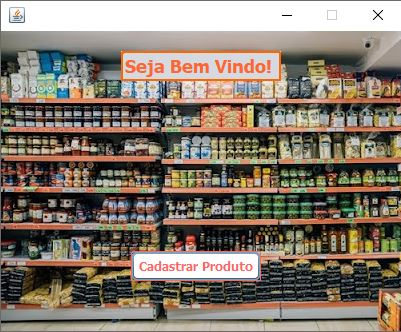
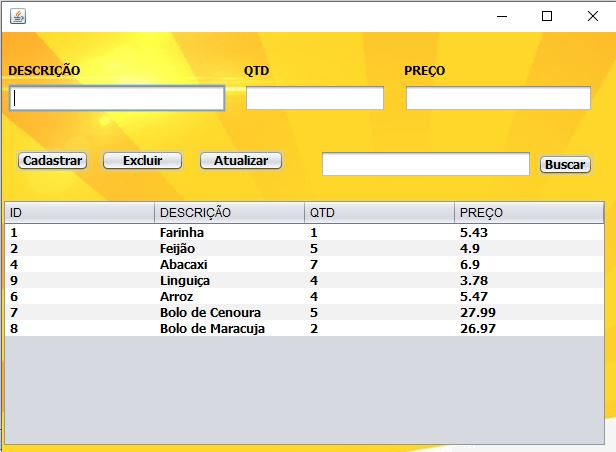

<h1 align="center">Sistema de Mercadinho</h1>
  
<h2 align="center">Sistema Desenvolvido com Java e Mysql.</h2>
 
 
<h2 align="center">Tela de Login</h2>

  
<h2 align="center">Tela Principal</h2>

  

<h2 align="center">Tela de Cadastro</h2>  

<h2>Histórico de lançamentos</h2>
<ul>
  <li>Versão 0.0.1</li>
  <ul>
    <li>Sistema em Desenvolvimento</li>
  </ul>
  <li>Proxima Versão 0.0.2</li>
  <ul>
    <li>Sera adicionado a Opção de Compra e Venda</li>
  </ul>
</ul>

<h2>Contribuir</h2>
<ul>
  <li>Faça o fork do projeto (https://github.com/yourname/yourproject/fork)</li>
  <li>Crie uma branch para sua modificação (git checkout -b feature/fooBar)</li>
  <li>Faça o commit (git commit -am 'Add some fooBar')</li>
  <li>Push (git push origin feature/fooBar)</li>
  <li>Crie um novo Pull Request</li>
</ul>
